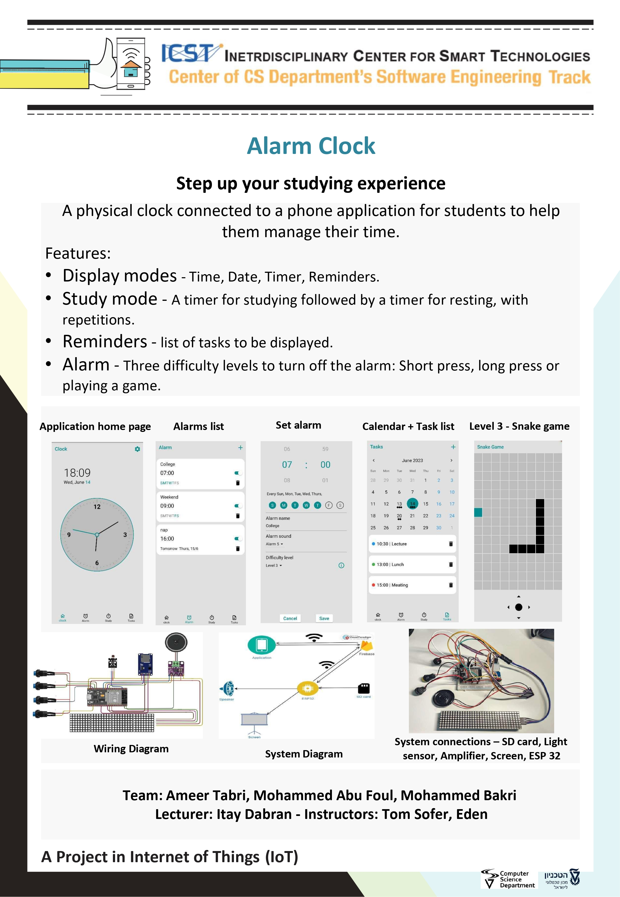

## Alarm Clock project by :  Ameer Tabri, Mohammad Abo Foul, Muhammad Bakri
  spring 2023 iot 236332/3 project

## Details about the project
  Our project is an alarm clock that is designed to help students manage their time schedule. 
  The project consists of two elements: a physical clock, and an application. 
  A basic usage is: setting an alarm via the app, and listening to the physical clock ring accordingly.

## Folder description :
* ESP32: source code for the esp side (firmware). 
The source code is in the folder "src", and the included external libraries are in the folder ".pio\libdeps\esp32doit-devkit-v1"
* Documentation: wiring diagram + basic operating instructions
* Unit Tests: tests for individual hardware components (input / output devices)
* flutter_app: dart code and audio assets for our Flutter app.
* Assets: Audio files used in this project

## Arduino/ESP32 libraries used in this project:
* ESP32-audioI2S - version 2.0.7
* NTPClient - version 3.2.1
* Firebase ESP32 Client - version 4.3.10
* ArduinoJson - version 6.21.2
* MD_Parola - version 3.6.2

## Project Poster:
  

This project is part of ICST - The Interdisciplinary Center for Smart Technologies, Taub Faculty of Computer Science, Technion
https://icst.cs.technion.ac.il/
